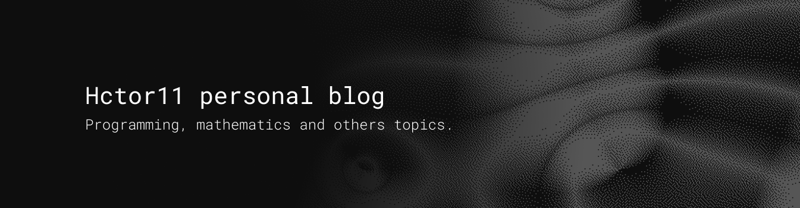

# Personal blog
Welcome to the GitHub repository of my personal blog! Join me as we dive deep into the captivating realms of mathematics, machine learning, calculus, and programming!

Crafted with passion, this blog serves as a platform to share my **enthusiasm** for these subjects, demystifying intricate concepts and making learning a joy for all. Through engaging articles, tutorials, and code snippets, I intertwine the allure of math, the might of machine learning, the finesse of calculus, and the artistry of programming. 

## Tech Stack

This blog is powered by AstroJS, TypeScript, and Sass, this space invites you to a journey of discovery and growth. Let's explore the harmonious blend of these topics and unlock new horizons together!


## How to get this project
You can copy this project with the follwing commands:

```{git}
git clone https://github.com/Hctor11/personal-blog.git
```

and then install the dependencies and run the code:

```{git}
npm i
npm run dev
```
